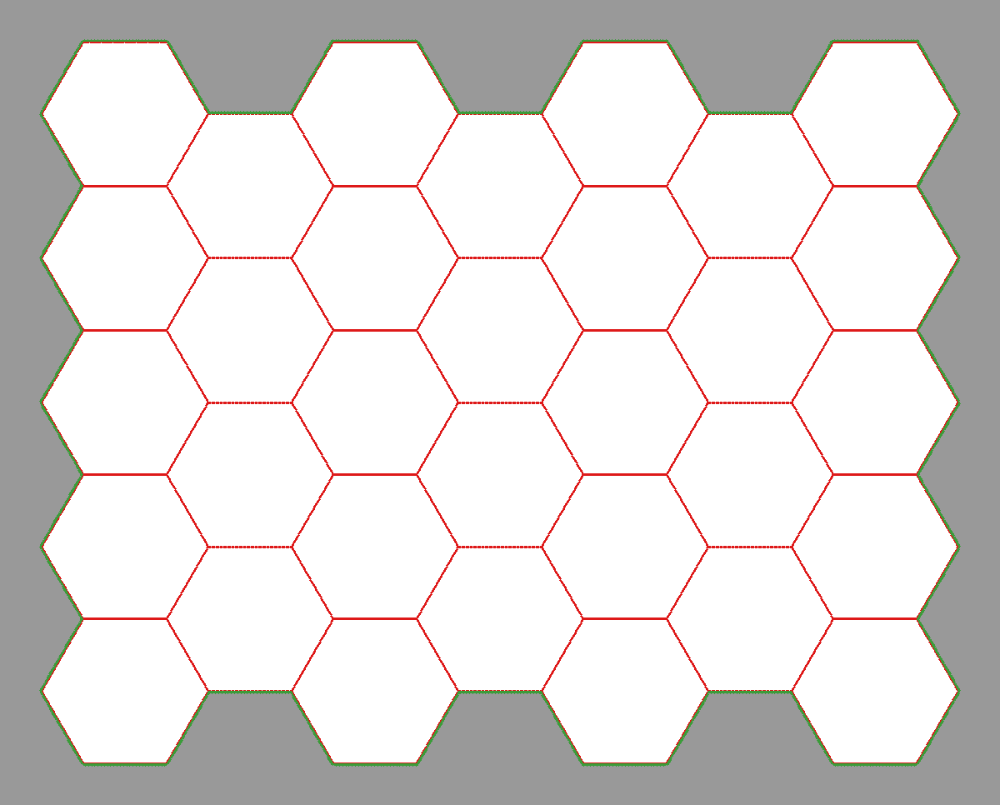

# hexmap.scm
    by Jérémy Zurcher
    http://asynk.ch

## DESCRIPTION:

A gimp script to produce hexagonal maps, with fancy features

## ISSUES:

* none known, thanks to @schumaml on gimp irc channel

## FEATURES:

* vertical / horizontal hex
* define your hex dimension through, side, point to point or side to side
* define #horizontal and #vertical hex
* offmap x and y offset
* erase/smooth none, hex edges or hex segments
* choose hex line width and colour
* choose map border line width and colour
* choose offmap mask opacity

## LICENSE:

[MIT](http://www.opensource.org/licenses/MIT) see [MIT_LICENSE](https://github.com/jeremyz/hexmap/blob/master/LICENSE)
